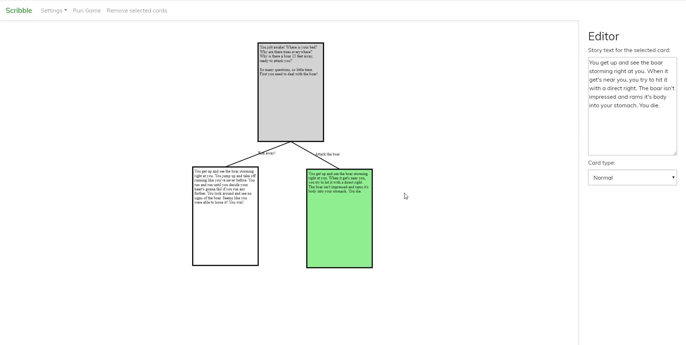
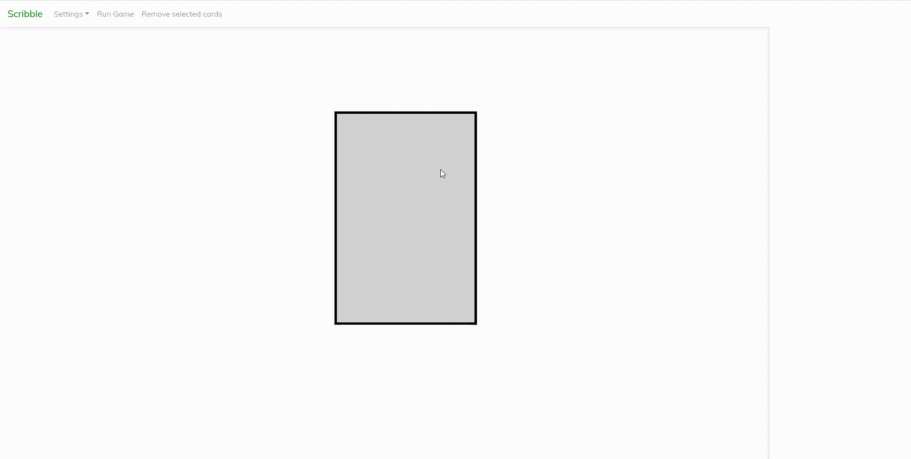
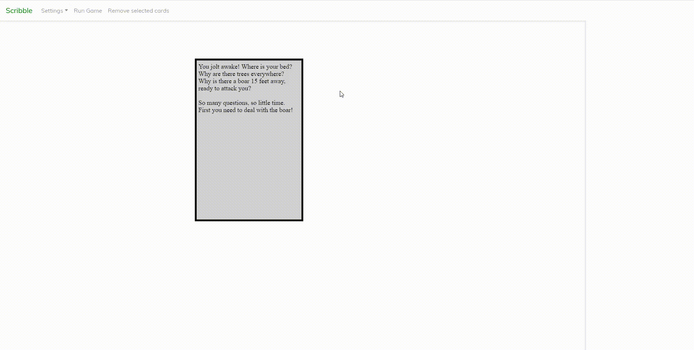
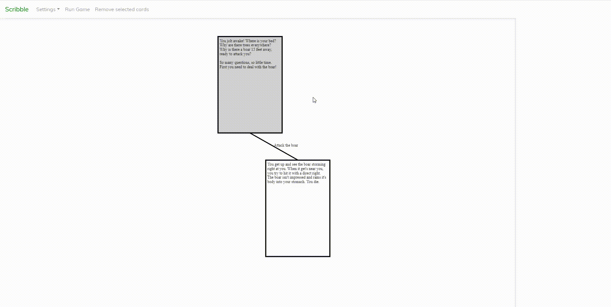
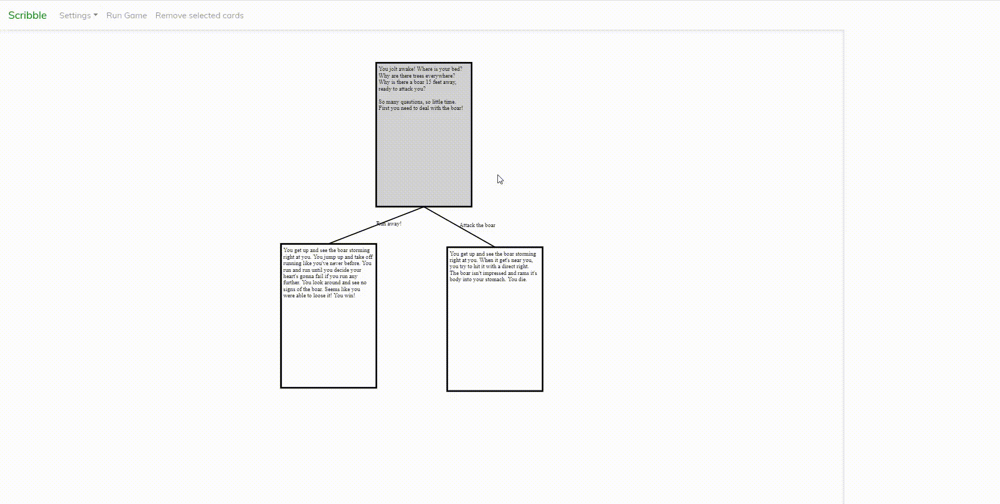
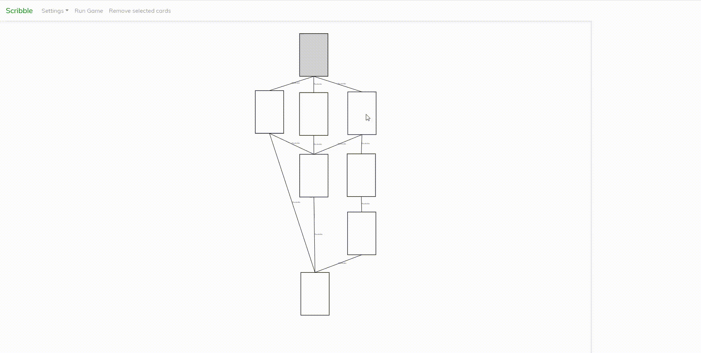
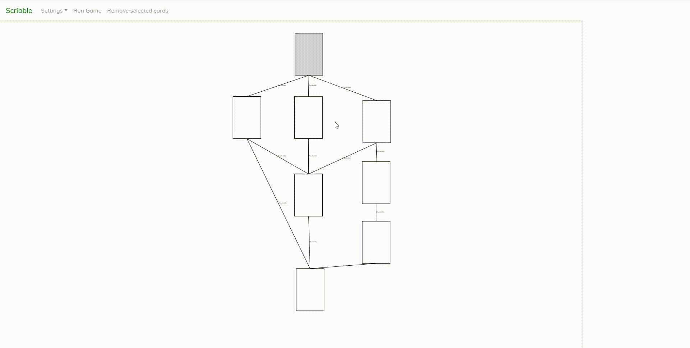

# Scribble
##### A visual tool for developing Create Your Own Adventure Games (CYOAG)
This tool can be used to write text-based games where the choices of the players affect the flow of the story. It's useful for visualizing the flow of your story.  
There currently is no export or build functionality of any kind. I do plan to implement an export to JSON feature in the future.  

For every prompt of text, it shows a card. Cards have connections with other cards, which represent the choices the user can choose from.  

Development on Scribble has slowed down due to a lack of time, so I'm making it available for general use.  
All contributions are welcome!

[Demo](https://gazotey.github.io/Scribble/) (master branch)

<table><tr><td>

</td></tr></table>

### Features available
##### Editing text
<table><tr><td>

</td></tr></table>

##### Adding choices for the user
<table><tr><td>

</td></tr></table>

<table><tr><td>

</td></tr></table>

##### Setting card types
<table><tr><td>

</td></tr></table>

##### Connecting cards
<table><tr><td>

</td></tr></table>

#### Selecting multiple cards
Multiple cards can be selected by dragging a selection or by using the shortcut (`CRTL` + `click` cards)  
<table><tr><td>

</td></tr></table>

#### Deleting cards
The `delete` button deletes all currently selected cards.
<table><tr><td>

</td></tr></table>

##### Previewing the game
<table><tr><td>

</td></tr></table>

### Missing essential features
I plan to implement at least these features at some point.
- Export game to JSON
- Load game to JSON

### Missing very-nice-to-have features
I _may_ implement some of these at some point.
- Undo/redo in editor
- Build JSON export as android game
- Saving/loading projects using IndexedDB

### Technical details
This tool has been written in plain Javascript, using JQuery for some events and for getting values from text fields.  
It uses the HTML5 Canvas API for drawing the cards, lines, and text without the use of any additional libraries.

### Dependencies
- JQuery (could be replaced with vanilla Javascript relatively easy)
- [Featherlight](https://github.com/noelboss/featherlight "Featherlight on Github") (for the Game Preview)

### Meta
Original version developed by Vincent van Hoven.  
Distributed under the GNU GPLv3 license.  
See `LICENSE` for more information or [choosealicense.com](https://choosealicense.com/licenses/gpl-3.0) for a quick overview of what this means.